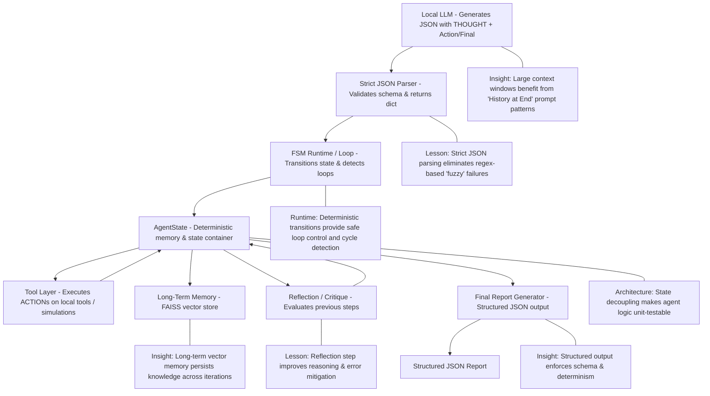
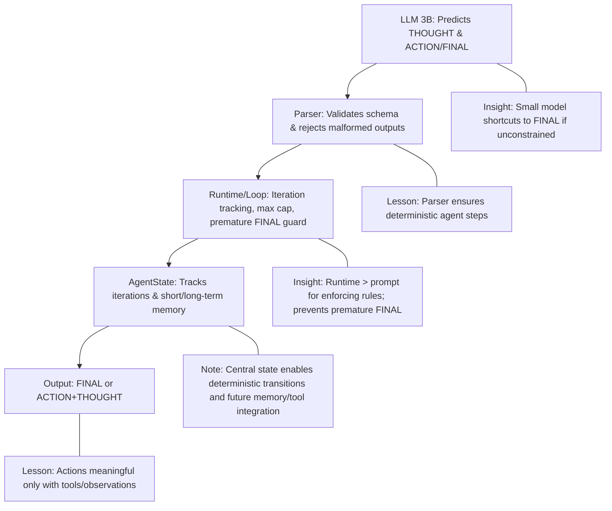
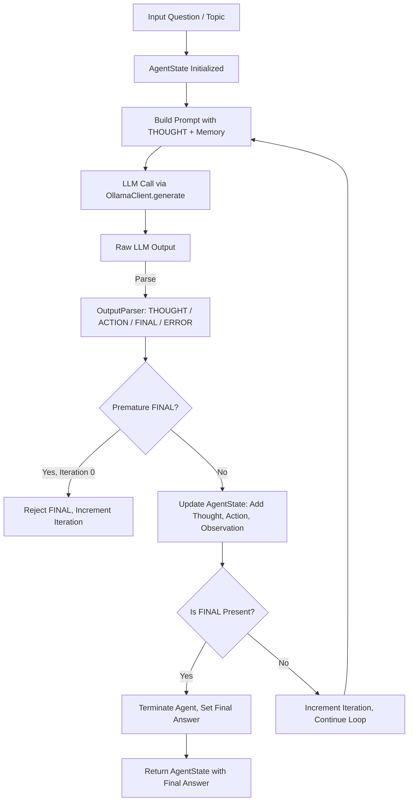
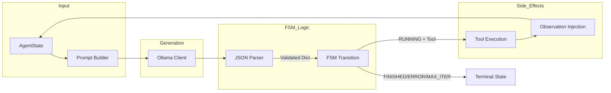
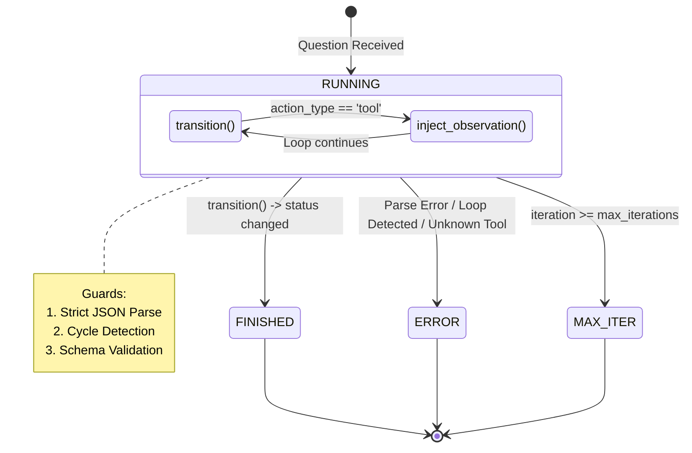
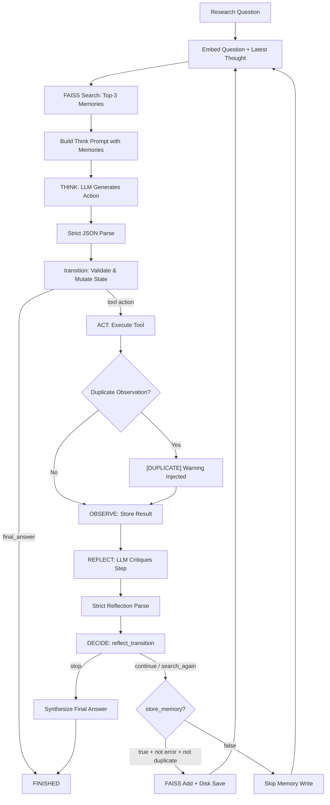
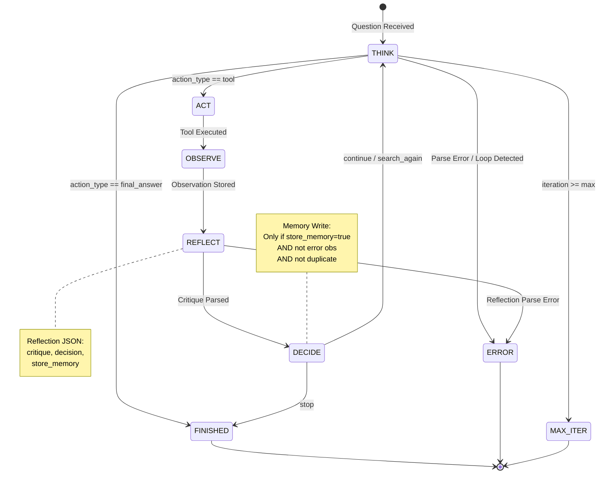

# Local Autonomous Research Agent

## Project Overview

This project builds a **fully local autonomous research agent** in Python with zero external APIs. The agent is designed to:

- Accept a research topic or question.
- Generate a research plan.
- Reason iteratively using a **ReAct-style loop**.
- Call only **local or simulated tools**.
- Maintain short-term memory and **long-term vector memory using FAISS**.
- Include a **reflection/critique phase**.
- Produce a structured JSON final report.
- Enforce strict iteration limits and guardrails.

**Constraints:**

- No cloud services or paid APIs.  
- Python-only, running fully locally via Ollama (LLM) + FAISS.  
- No LangChain, AutoGen, or high-level agent frameworks initially.  
- Manual implementation of ReAct loop, tool abstraction, parser, memory injection, logging, and deterministic control.

---

## Project Architecture

**High-Level Flow:**

**Key Principles:**

- **Separation of concerns:**  
  - LLM = policy engine  
  - Parser = validator  
  - FSM Transition = controller/state logic  
  - AgentState = deterministic data container  

- **Guardrail Principles:**
  - **Runtime > Prompt:** Determinism is enforced by code (FSM), not just by "wishing" in the prompt.
  - **Absorbing States:** Once the agent enters FINISHED or ERROR, it stays there. No "ghost" iterations.
  - **Circuit-Breakers:** Loop detection acts as a deterministic halt for hallucination cycles.
  - **Instruction Salience:** Placing grounding data (History/Rules) at the generation point (prompt bottom) improves compliance in small models.

- **Tool/environment dependencies** are required to motivate multi-step reasoning.  
- **Parse errors and rejected outputs** are informative signals for agent design.

---

## Daily Progress Tracker

### Day 1 – Setup, Loop & Schema Validation

**Objectives Completed:**

- Installed and tested Ollama locally with 3B LLM.
- Implemented deterministic agent loop with iteration tracking, max iteration cap, logging, and AgentState.
- Defined ReAct-style structured output schema: THOUGHT + ACTION or THOUGHT + FINAL; parser enforces mutual exclusivity.
- Added runtime guard to reject premature FINAL.
- Tested and simplified prompts for stable compliance.

**Key Lessons:**

- Small models often shortcut to FINAL; cannot reliably enforce multi-step reasoning in prompt.  
- Runtime enforcement is critical; prompt alone is fragile.  
- Over-constraining prompts destabilizes outputs; minimal prompt + runtime guard is more robust.  
- Actions will only become meaningful when tools/observations exist.  
- Deterministic loop, parser, and AgentState provide safe, reproducible control.

### Day 2 – Multi-Iteration Loop & Tool Integration

**Objectives Completed:**

- Refactored loop into `loop.py` with clear separation from `main.py`; main now acts as a lightweight facade.  
- Verified OutputParser works end-to-end with structured THOUGHT, ACTION, FINAL parsing, including error handling for malformed or missing fields.  
- Connected `search_local_knowledge` tool; simulated observation correctly stored in AgentState.  
- Tested minimal prompt scenarios to validate loop, parser, and tool interactions without excessive delays.

**Key Lessons:**

- LLMs still attempt to shortcut to FINAL; iteration-based guardrails are essential for consistent ReAct behavior.  
- Prompt complexity and model size directly affect local generation time; even first iteration can be slow with long prompts.  
- AgentState updates (thoughts, actions, observations) must be deterministic and explicitly handled per iteration.  
- Minimal prompts confirm structural correctness of loop and parser before introducing multi-step reasoning with real questions.

### Day 3 – Deterministic FSM & Strict JSON Contract

**Objectives Completed:**

- **Deterministic FSM Migration:** Replaced the fragile boolean-based `terminated` flag with a formal state machine (`RUNNING`, `FINISHED`, `ERROR`, `MAX_ITER`).
- **Strict JSON Output Contract:** Enforced a zero-tolerance JSON schema for LLM outputs, eliminating regex-based "fuzzy" parsing.
- **Cycle Detection (Loop Prevention):** Implemented runtime tracking of tool-call signatures to detect and terminate on "hallucination loops."
- **Prompt Recency Optimization:** Reordered prompt structure to place **Conversation History** and **Stopping Criteria** at the very bottom, leveraging the LLM's recency bias for faster convergence.
- **Refined Termination Logic:** Adjusted state transitions to allow successful finalization even on the final leg.

**Key Lessons:**

- **Absorbing States:** Formalizing terminal states ensures that once the agent leaves `RUNNING`, no further mutations or "ghost iterations" can occur.
- **JSON as a Protocol:** Treating the LLM as a structured data provider rather than a text generator significantly increases reliability in small (3B) models.
- **Hallucination Loop Countermeasures:** Autonomous agents are prone to repetitive reasoning cycles; runtime cycle detection is a mandatory "deterministic circuit-breaker" for production code.
- **Instruction Salience:** Local LLMs have limited attention; placing critical grounding data (History/Rules) at the end of the prompt (the "generation point") dramatically improves instruction following.
- **Pure Function Core:** By moving state mutation into a pure `transition()` function, the agent's logic becomes fully testable and decoupled from the non-deterministic LLM client.

### Day 4 – Reflection Stage & FAISS Vector Memory

**Objectives Completed:**

- **FSM Extended to 6 States:** `THINK → ACT → OBSERVE → REFLECT → DECIDE → THINK | STOP`. Reflection is an explicit FSM state, not embedded inside THINK.
- **Reflection/Self-Critique:** Added `agent/reflection.py` with `strict_reflection_parse()` enforcing `{"critique", "decision", "store_memory"}` JSON contract. LLM critiques each reasoning step before deciding to continue, search again, or stop.
- **FAISS Vector Memory:** Implemented `memory/vector_store.py` (`VectorMemory`) with `IndexFlatL2` and parallel `documents[]` list. Supports `add()` with deduplication and `search()` with `k=3`.
- **Local Embedding Pipeline:** `memory/embedding.py` wraps `sentence-transformers/all-MiniLM-L6-v2` (384-dim). No remote APIs.
- **Memory Persistence:** FAISS index + documents list saved to `data/memory.faiss` and `data/memory.json` after every write. Loaded at init if files exist — true long-term memory across runs.
- **Memory Retrieval Injection:** Before each THINK step, the research question + latest thought are embedded and top-3 memories are injected into the prompt context.
- **Memory Write Policy:** LLM proposes `store_memory: true/false`; the loop enforces deterministically. Error observations and duplicates are never stored.
- **Observation-Level Duplicate Detection:** Tools returning the same observation as a previous call trigger a `[DUPLICATE]` warning, nudging the LLM to change approach.
- **Dual-Phase FSM Tracking:** `fsm_phase` (THINK/ACT/OBSERVE/REFLECT/DECIDE) tracks position within an iteration, orthogonal to `status` (RUNNING/FINISHED/ERROR/MAX_ITER) which controls loop termination.

**Key Lessons:**

- **Recency Bias is Real:** Small LLMs pay most attention to the end of the prompt. Critical context (question, known facts, stopping criteria) must be at the bottom, not the top. Format examples and rules go at the top as reference material.
- **Memory Without Persistence is Pointless:** An in-memory-only vector store provides no value across runs. FAISS `write_index`/`read_index` + JSON document persistence is the minimum viable approach.
- **Observation-Level Guards > Input-Level Guards:** Tool-input loop detection misses cases where different inputs produce identical outputs (e.g., different substrings matching the same KB entry). Checking observation equality catches this.
- **FAISS Index Boundary Gotcha:** FAISS uses `-1` as a sentinel for "no more results" when `k > n_docs`. Python negative indexing silently wraps around instead of erroring — always guard with `idx >= 0`.
- **Reflection Needs Separation:** Making reflection an explicit FSM state (not embedded in THINK) keeps the JSON contracts clean and makes each phase independently testable.
- **Type Assumptions Kill:** When multiple tools return different types (str vs int vs dict), any code touching observations must handle polymorphic returns. The `Tool.run()` contract says `-> str` but implementations don't always comply.
- **Prompt Engineering for Small Models is Architecture:** For 3B models, prompt wording changes alone often fail. Effective "prompt engineering" means restructuring *what information appears where* and adding *architectural guardrails* (observation dedup, memory dedup) rather than hoping the model follows instructions.

---

## Daily Cheat Sheets

**Day 1 Cheat Sheet:**

  
  
**Day 2 Cheat Sheet:**

**Day 3 Cheat Sheet (Decoupled Pipeline):**

**Day 3 State Transitions:**

**Day 4 Cheat Sheet (Full FSM with Reflection & Memory):**

**Day 4 State Transitions:**

---