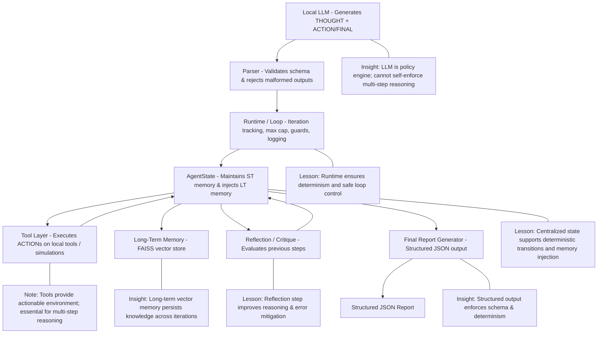
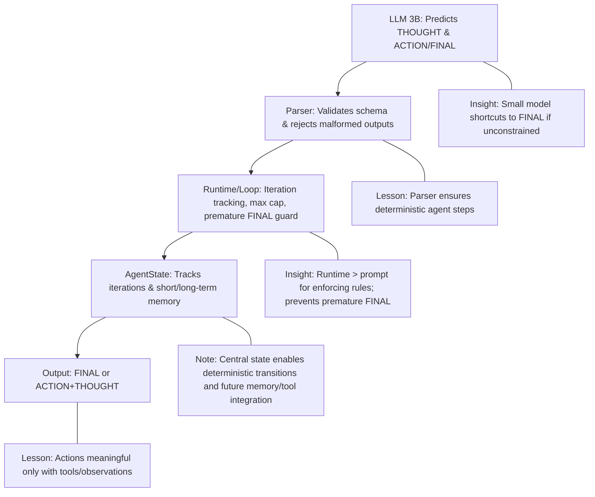

# Local Autonomous Research Agent

## Project Overview

This project builds a **fully local autonomous research agent** in Python with zero external APIs. The agent is designed to:

- Accept a research topic or question.
- Generate a research plan.
- Reason iteratively using a **ReAct-style loop**.
- Call only **local or simulated tools**.
- Maintain short-term memory and **long-term vector memory using FAISS**.
- Include a **reflection/critique phase**.
- Produce a structured JSON final report.
- Enforce strict iteration limits and guardrails.

**Constraints:**

- No cloud services or paid APIs.  
- Python-only, running fully locally via Ollama (LLM) + FAISS.  
- No LangChain, AutoGen, or high-level agent frameworks initially.  
- Manual implementation of ReAct loop, tool abstraction, parser, memory injection, logging, and deterministic control.

---

## Project Architecture

**High-Level Flow:**

**Key Principles:**

- **Separation of concerns:**  
  - LLM = policy engine  
  - Parser = validator  
  - Runtime/Loop = controller/enforcer  
  - AgentState = deterministic memory/state  

- **Minimal prompt + runtime enforcement** ensures stability.  
- **Tool/environment dependencies** are required to motivate multi-step reasoning.  
- **Parse errors and rejected outputs** are informative signals for agent design.

---

## Daily Progress Tracker

### Day 1 – Setup, Loop & Schema Validation

**Objectives Completed:**

- Installed and tested Ollama locally with 3B LLM.
- Implemented deterministic agent loop with iteration tracking, max iteration cap, logging, and AgentState.
- Defined ReAct-style structured output schema: THOUGHT + ACTION or THOUGHT + FINAL; parser enforces mutual exclusivity.
- Added runtime guard to reject premature FINAL.
- Tested and simplified prompts for stable compliance.

**Key Lessons:**

- Small models often shortcut to FINAL; cannot reliably enforce multi-step reasoning in prompt.  
- Runtime enforcement is critical; prompt alone is fragile.  
- Over-constraining prompts destabilizes outputs; minimal prompt + runtime guard is more robust.  
- Actions will only become meaningful when tools/observations exist.  
- Deterministic loop, parser, and AgentState provide safe, reproducible control.

**Day 1 Cheat Sheet:**

---